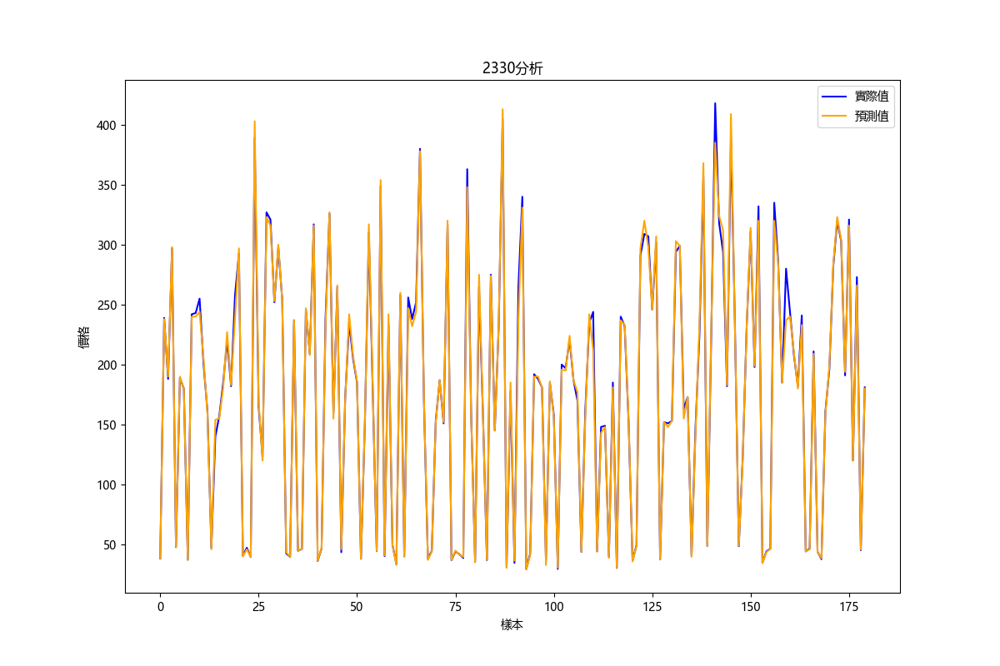

# 🌳 台股走勢預測（Decision Tree）

以 **scikit-learn 決策樹迴歸** 預測股票收盤價的 Flask 網頁應用：輸入股票代碼與回溯年數，自動下載歷史資料、建立特徵、訓練模型並繪出預測結果。

> 個人專案｜機器學習、資料前處理、視覺化



## 流程

```
輸入代碼與年數 → yfinance 下載歷史資料 → 特徵工程 → 訓練 / 測試切分 → DecisionTreeRegressor → MSE / R² 評估 → 繪圖輸出
```

- **特徵**：開盤價、最高價、最低價、成交量、5 日均線（MA5）、10 日均線（MA10）
- **目標**：收盤價
- **評估**：Mean Squared Error、R² Score
- **視覺化**：matplotlib 繪製實際值與預測值比較圖

## 技術

`Python` · `scikit-learn` · `pandas` · `NumPy` · `matplotlib` · `yfinance` · `Flask`

## 專案結構

```
預測.py            # Flask 主程式：下載資料、訓練模型、輸出預測圖
utils.py           # yfinance 歷史資料下載工具
templates/         # 輸入頁與結果頁
static/            # 預測結果圖
2330.csv           # 範例資料（台積電）
```

## 執行方式

```bash
pip install -r requirements.txt
python 預測.py
```

開啟 `http://127.0.0.1:5000`，輸入代碼（台股請加 `.TW`，例如 `2330.TW`）與年數。

## 後續規劃

- 與 [money｜台股查詢平台](https://github.com/minghan5487/money) 整合，同時提供即時資訊與趨勢預測
- 改以時間序列切分驗證，並比較隨機森林、XGBoost 等模型

---
作者：[吳明翰](https://minghan5487.github.io/my/)
